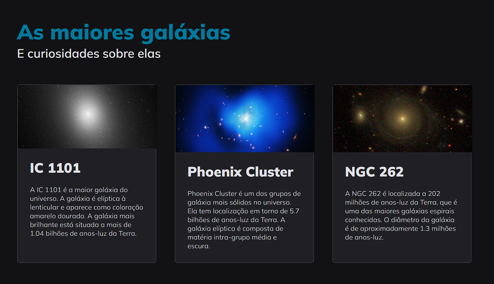

<h1 align="center"> Galaxies </h1>

Projeto desenvolvido no modulo 3 do Explorer da Rocketseat com os primeiros conhecimentos em grid.  

  

  

 <h2 align="center"><a href="https://kaiquerebonato.github.io/Galaxies/" target="_blank">Projeto ao vivo</a></h2>

### 🚀 Tecnologias

Esse projeto foi desenvolvido com as seguintes tecnologias:

- HTML e CSS
- Git e Github
- Figma

### :memo: Licença

Esse projeto está sob a licença MIT.

---

Feito com ♥ por Kaique Rebonato :wave: